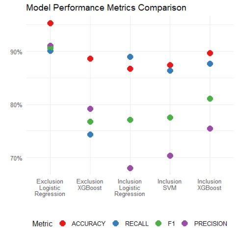

```{r setup, include=FALSE}
library(flexdashboard)
library(tidyverse)
library(kableExtra)
library(readxl)
library(haven) 
library(stringr) 
library(ggplot2) 
library(GGally)
library(sf) 
library(mapview)
library(viridis)
```

# Project Overview

## Column {data-width="500"}

**Introduction**

This project focuses on predicting stroke risk using a synthetic electronic health record (EHR) dataset that represents individuals aged 30-70 from Massachusetts. The dataset is designed to mimic real-world healthcare patterns and includes detailed patient information, such as symptoms, diagnoses, and lab results. It provides a unique opportunity to explore machine learning in the context of health outcomes.

The dataset is available on the Harvard Dataverse:
<a href="https://dataverse.harvard.edu/file.xhtml?fileId=6707765&version=1.0" target="_blank">Link to Dataset </a>

**Research Question**

How does the inclusion or exclusion of stroke-specific risk factors in electronic health records affect the ability of machine learning models to accurately predict stroke, considering both the accuracy of positive predictions (precision) and the ability to identify all true cases (recall)?

**Data Overview**

The dataset used in this project is part of Synthea’s synthetic stroke series and includes 30,000 patients, with a 1:3 ratio of stroke to non-stroke cases, with 25% of the patients resulting in stroke and 75% of the patients resulting in no stroke.

Synthea generates data through simulations designed to reflect real-world healthcare scenarios, including symptom reporting, lab results, and diagnoses.

## Column {data-width="500"}


# Data Processing

## Column {data-width="500"}

Future Text

## Column {data-width="500"}
###
Data Source: [Harvard Dataverse](https://dataverse.harvard.edu/file.xhtml?fileId=6707764&version=1.0)

Future Text

###

Future Text

# Model Performance

## Column {data-width="500" data-height="1000"}


## Column 
### {data-height="333"}
**Logistic Regression**

The Logistic Regression model shows the best recall among the three models, making it particularly valuable in healthcare, where minimizing false negatives (missed stroke cases) is critical. 

 **Interpretability:** 
 
Logistic Regression is inherently interpretable because it directly models the relationship between predictors (electronic health records) and the probability of the outcome (stroke). This transparency is crucial in healthcare for building trust and enabling informed decisions.

### {data-height="334"}
**Support Vector Machines (SVM)**

SVM performs well across all metrics but is slightly outperformed by XGBoost in accuracy, precision, and F1 score. However, its recall is lower than Logistic Regression, which might limit its use in cases prioritizing sensitivity over precision.

 **Interpretability:**
 
SVM, particularly with non-linear kernels, is less interpretable, making it less ideal for healthcare applications where understanding the model's decisions is essential.

### {data-height="333"}
**XGBoost**

XGBoost achieves the highest accuracy, F1 score, and precision, excelling at balancing false positives and negatives. However, its recall is slightly lower than Logistic Regression, meaning it might miss more stroke cases.

 **Interpretability:**
 
As a "black-box" model, XGBoost lacks transparency. Techniques like SHAP can provide some insight, but it remains less interpretable than Logistic Regression, which would limit its use in high-stakes clinical settings.


# Interpretability

## {data-width="500" data-height="100"}

**Interpreting Machine Learning Models**


### {data-width="500" data-height="500"}

Future Text

### {data-width="500" data-height="400"}
Predicting Stroke Logistic Regression Coefficients

## Column {data-width="500" data-height="1000"}

```{r}
lr_coef_plot <- readRDS("C:/Users/duffy/Documents/SDR/Machine_Learning/Stroke_Final_Project/data/lr_coef_plot.RDS")
lr_coef_plot
```


