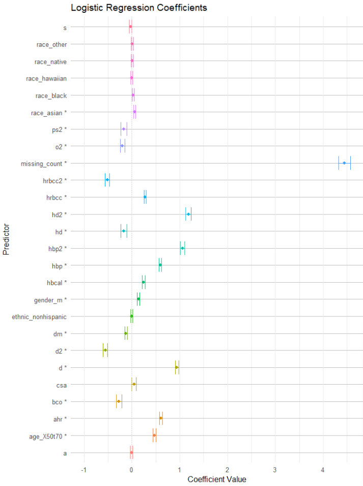

```{r setup, include=FALSE}
library(flexdashboard)
library(tidyverse)
library(kableExtra)
library(readxl)
library(haven) 
library(stringr) 
library(ggplot2) 
library(GGally)
library(sf) 
library(mapview)
library(viridis) #Loading colorblind-friendly color map package: viridisLite

```

# Data Processing

## Column {data-width="500"}

Future Text

## Column {data-width="500"}
###
Data Source: [Harvard Dataverse](https://dataverse.harvard.edu/file.xhtml?fileId=6707764&version=1.0)

Future Text

###

Future Text

# Model Performance

## Column {data-width="500"}

### {data-height="650"}

```{r echo=FALSE}
Logistic_Regression_Model <- readRDS("C:/Users/duffy/Documents/SDR/Machine_Learning/Stroke_Final_Project/data/Logistic_Regression_Model.RDS")
XGBoost_Model <- readRDS("C:/Users/duffy/Documents/SDR/Machine_Learning/Stroke_Final_Project/data/XGBoost_Model.RDS")
SVM_Model <- readRDS("C:/Users/duffy/Documents/SDR/Machine_Learning/Stroke_Final_Project/data/svm_model.RDS")

Combined_Models <- rbind(Logistic_Regression_Model, 
                         XGBoost_Model,
                         SVM_Model)
Combined_Models <- Combined_Models %>%
  mutate(Model = case_when(
    Model == "Logistic Regression Model" ~ "Logistic Regression",
    Model == "XGBoost Model" ~ "XGBoost",
    Model == "SVM Model" ~ "SVM",
    TRUE ~ Model
  )) 
  
Combined_Models_long <- Combined_Models %>% 
  pivot_longer(cols = -Model, names_to = "Metric", values_to = "Value")

library(RColorBrewer)
ggplot(Combined_Models_long, aes(x = Model, y = Value, color = Metric)) +
  geom_point(size = 4) +
  geom_line(aes(group = Metric)) +
  theme_minimal() +
  labs(
    title = "Comparison of Model Performance Metrics",
    x = "Model",
    y = "Metric Value",
    color = "Metric"
  ) +
  scale_y_continuous(labels = scales::percent_format(accuracy = 1)) +
  scale_color_brewer(palette = "Set1") +  
  theme(axis.text.x = element_text(hjust = .5),
        legend.position = "right"
  )

```

### {data-height="350"}
```{r echo=FALSE}
Combined_Models <- Combined_Models %>%
select(Model, ACCURACY, RECALL, F1, PRECISION)

kbl(Combined_Models %>% mutate(across(where(is.numeric), ~round(.,4))),
    caption ="Table: Model Prediction") %>%
  kable_styling(latex_options = c("hold_position", "scale_down"))
```


## Column 
### {data-height="333"}
**Logistic Regression**

The Logistic Regression model shows the best recall among the three models, making it particularly valuable in healthcare, where minimizing false negatives (missed stroke cases) is critical. 

 **Interpretability:** 
 
Logistic Regression is inherently interpretable because it directly models the relationship between predictors (electronic health records) and the probability of the outcome (stroke). This transparency is crucial in healthcare for building trust and enabling informed decisions.

### {data-height="334"}
**Support Vector Machines (SVM)**

SVM performs well across all metrics but is slightly outperformed by XGBoost in accuracy, precision, and F1 score. However, its recall is lower than Logistic Regression, which might limit its use in cases prioritizing sensitivity over precision.

 **Interpretability:**
 
SVM, particularly with non-linear kernels, is less interpretable, making it less ideal for healthcare applications where understanding the model's decisions is essential.

### {data-height="333"}
**XGBoost**

XGBoost achieves the highest accuracy, F1 score, and precision, excelling at balancing false positives and negatives. However, its recall is slightly lower than Logistic Regression, meaning it might miss more stroke cases.

 **Interpretability:**
 
As a "black-box" model, XGBoost lacks transparency. Techniques like SHAP can provide some insight, but it remains less interpretable than Logistic Regression, which would limit its use in high-stakes clinical settings.


```{r}

```
# Interpretability

## {data-width="1000" data-height="100}

**Interpreting Machine Learning Models**


### {data-width="500" data-height="500"}

Future Text

### {data-width="500" data-height="400"}
Predicting Stroke Logistic Regression Coefficients

## Column {data-width="500" data-height="800"}


